<div style="text-align: center; font-size: 60px; font-weight: bold; font-style: italic; font-family: 'Courier New', Courier, monospace;">
  WhuDatabase-iOS
</div>

# 介绍
WhuDatabase-iOS是WhuDatabase的iOS版本，是一个可在iOS设备上部署的多模数据库。WhuDatabase-iOS目前支持关系型数据、向量型数据、文档型数据、空间数据以及部分图模型数据的算子。

WhuDatabase-iOS基于SQLite实现。SQLite是一个开源的关系型数据库，被广泛应用于手机等嵌入式设备。我们利用SQLite的扩展机制，通过在SQLite运行时加载Spatialite、sqlite-vec、json1等扩展，来支持多模数据。下面是对相关扩展的简单介绍：

* Spatialite：一个开源的空间数据引擎，可以让SQLite支持空间数据，并支持部分图模型数据的算子（最短路径）。

* sqlite-vec：一个开源的SQLite向量扩展，可以让SQLite支持向量数据的存储和向量运算（加减、规范化、KNN等）。

* json1：SQLite官方的json扩展，可以让SQLite支持文档型数据。由于使用频率很高，SQLite官方将其直接加入SQLite内核。

# 使用方法

这一部分介绍如何在iOS开发中使用WhuDatabase-iOS。

## 开发工具

* Mac：iOS开发必须在Mac上进行。

* Xcode：Mac上必须安装Xcode和相关开发套件（模拟器）。

* iPhone：真机测试需要在iPhone上进行。

## WhuDatabase-iOS重要组件

* sqlite3.h：SQLite的头文件。

* libsqlite.a：SQLite的静态库（iOS-Simulator和iOS两个版本）。

* vec0.dylib：sqlite-vec的动态库（iOS-Simulator和iOS两个版本）。

* mod_spatialite.dylib：spatialite的动态库（iOS-Simulator和iOS两个版本）。

> iOS-Simulator和iOS两个版本是因为模拟器和真机是两种不同的架构，在模拟器上测试需要iOS-Simulator版本的库，在真机上测试需要iOS版本的库。

## 快速上手

以真机为例，介绍如何在真实项目中使用WhuDatabase。

### 创建项目

1. 打开Xcode，选择"Create New Project..."。

    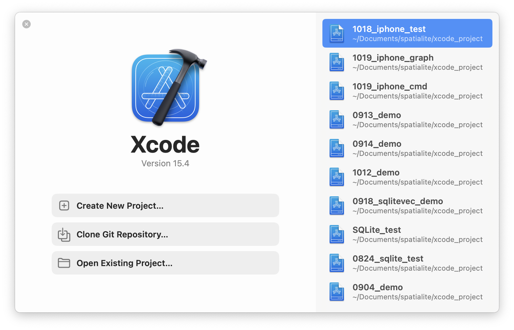

2. 选择“iOS” -> “App”。

    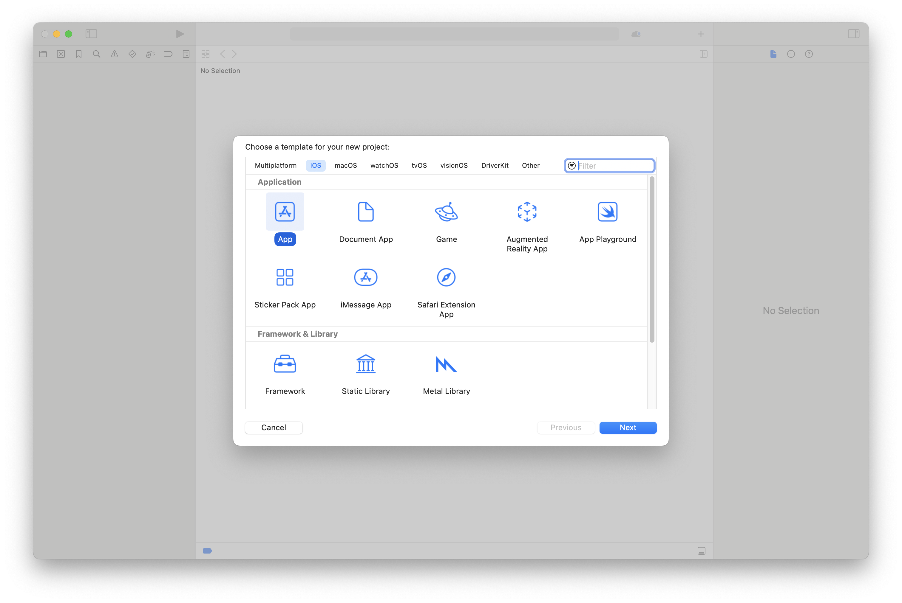

3. 输入项目信息，Interface选择"SwiftUI"，Language选择“Swift”。

    > 如果使用OC开发，选择”Storyboard“和”Objective-C“。

    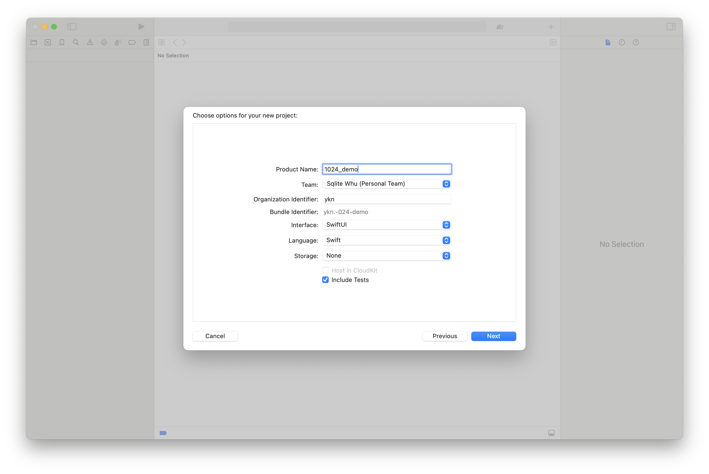

4. 选择项目保存路径后进入项目。

    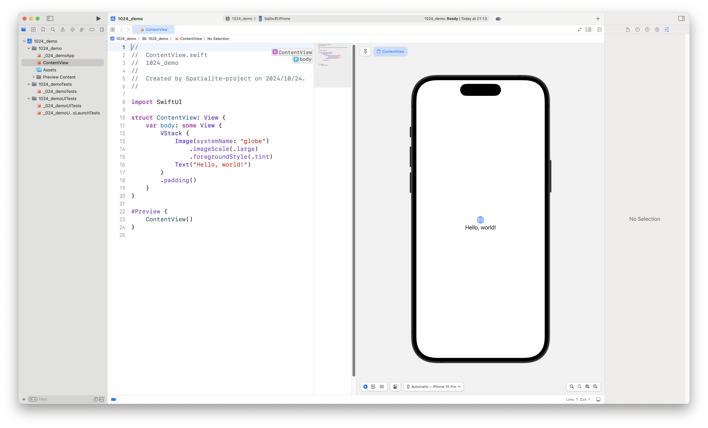

5. 连接设备。

    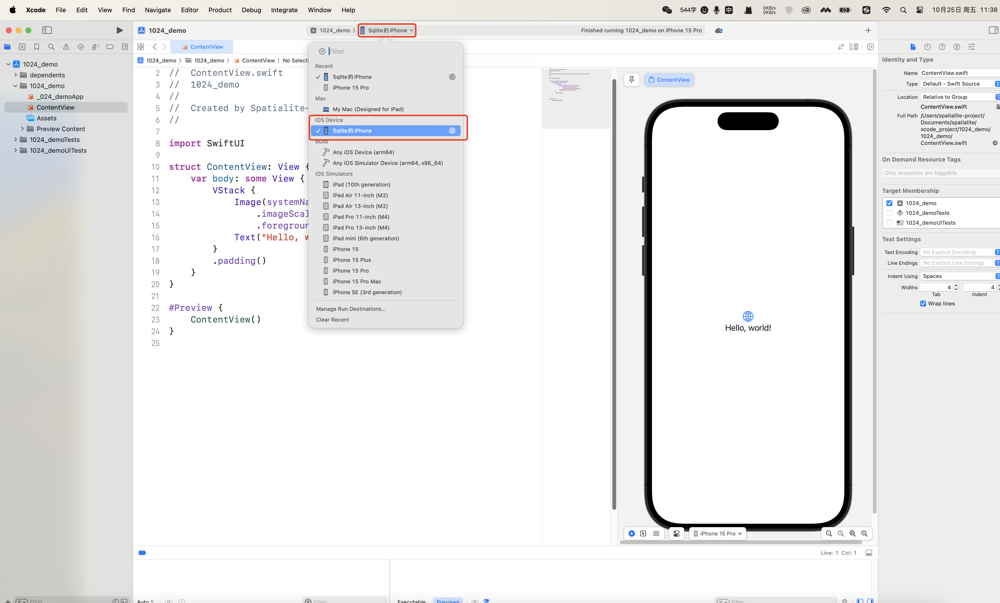

6. 点击“▶️”构建并运行项目。确保项目可以在iPhone上成功运行。

    <div style="text-align: center;"></div>

### 配置项目

1. 在项目根目录右键选择“New Group”创建新的文件夹dependents

    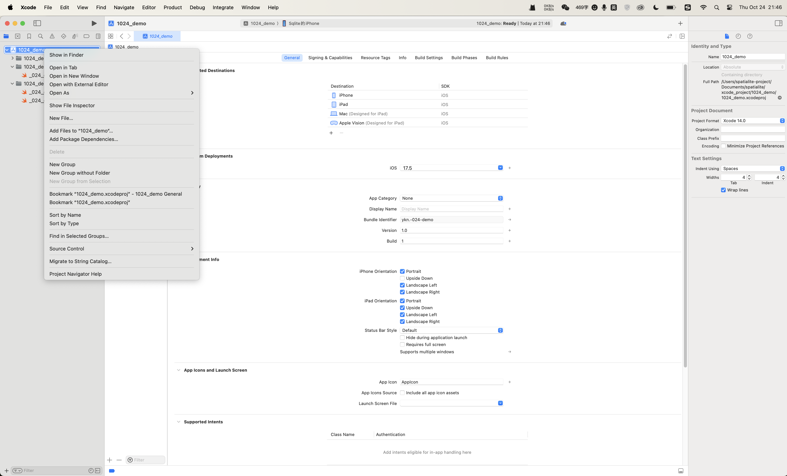

2. 右键点击dependents目录，选择“Add Files to 'xxx'”添加sqlite3.h，libsqlite.a，mod_spatialite.dylib，vec0.dylib。在选择文件时，勾选“Copy items id needed”。

    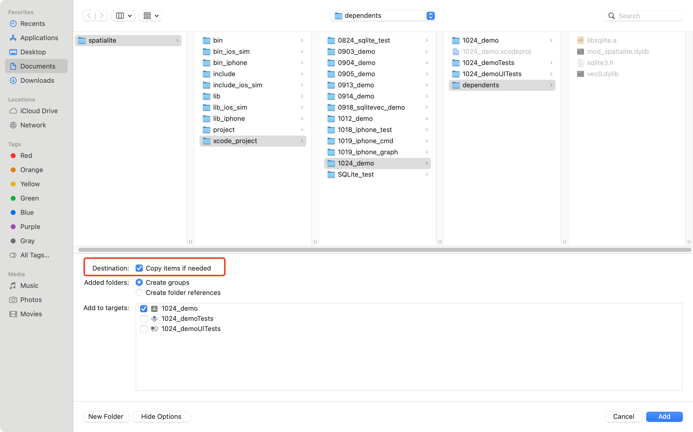

3. 点击项目根目录文件夹，打开项目配置页面。点击“Build Phases” -> “Copy Bundle Resources”，确保vec0.dylib和mod_spatialite.dylib被成功添加（如果没有，需要手动添加）。

    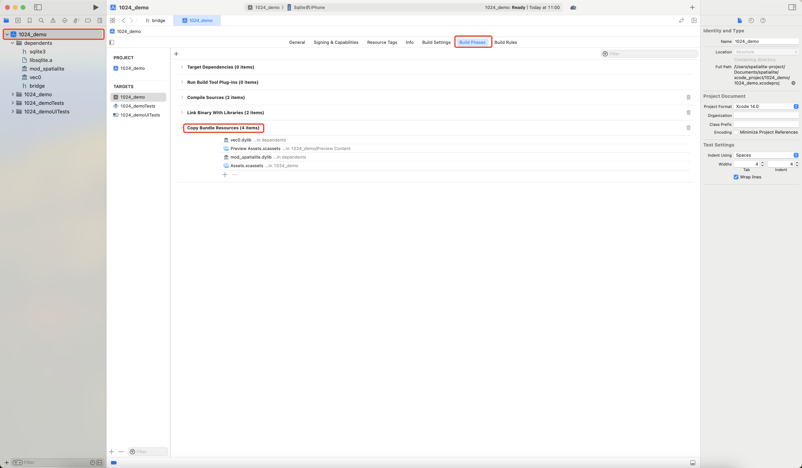

4. 在dependents目录右键选择“New File...” -> “Source” -> “Header File”，添加桥接头文件bridge.h。
    
    > 如果使用OC开发，不需要引入使用桥接头文件，直接在用到sqlite C API文件中添加``#import "sqlite3.h"``。

    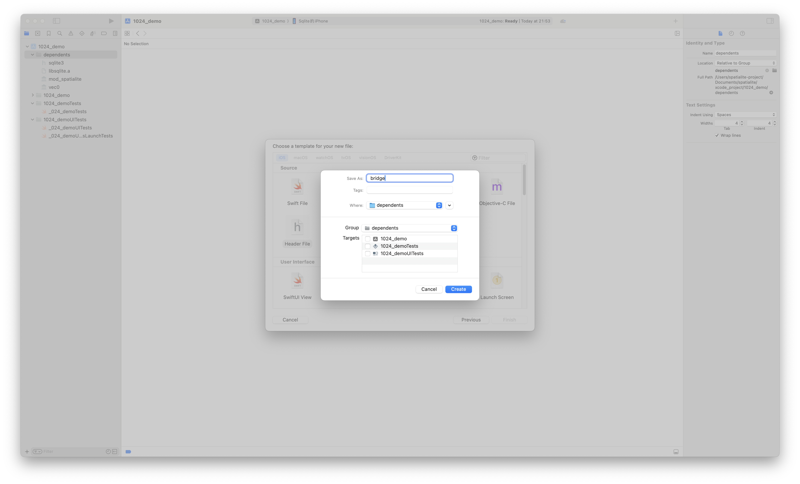

5. 在bridge.h中添加：

    > OC开发不需要桥接头文件，略过这一步。

    ``` c
    #import "sqlite3.h"
    ```

    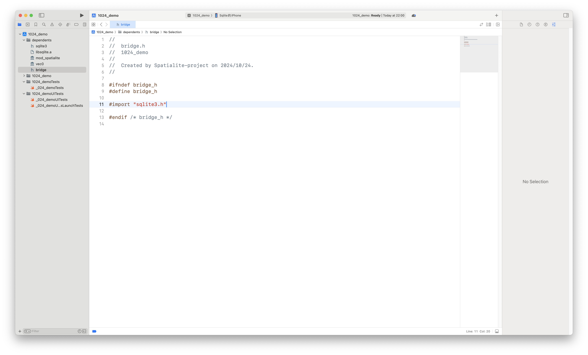

6. 在项目配置页面选择“General” -> "Frameworks, Libraries, and Embedded Content"，确保libsqlite.a被成功添加（**如果有vec0.dylib，mod_spatialite.dylib，将其移除**）。

    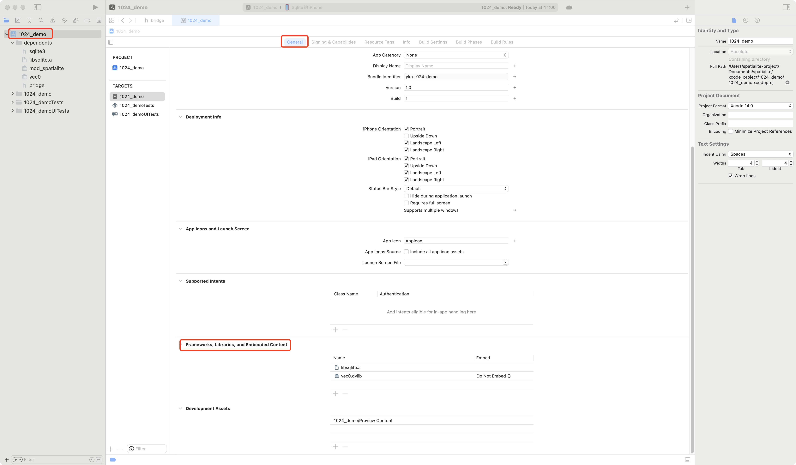

7. 在项目配置页面选择“Build Settings”，需要修改多处：

* “Search Paths”：“Header Search Paths”和“Library Search Path”设置为dependents文件夹的路径。

    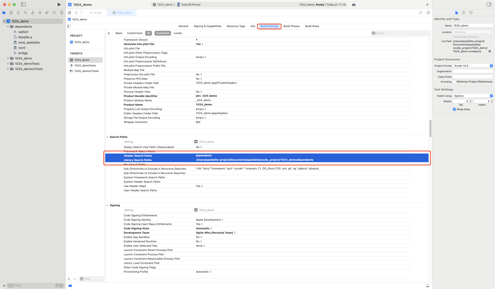

* “Swift Compiler - General”：设置“Objective-C Bridging Header”为桥接头文件的路径。

    > OC开发略过这一步。

    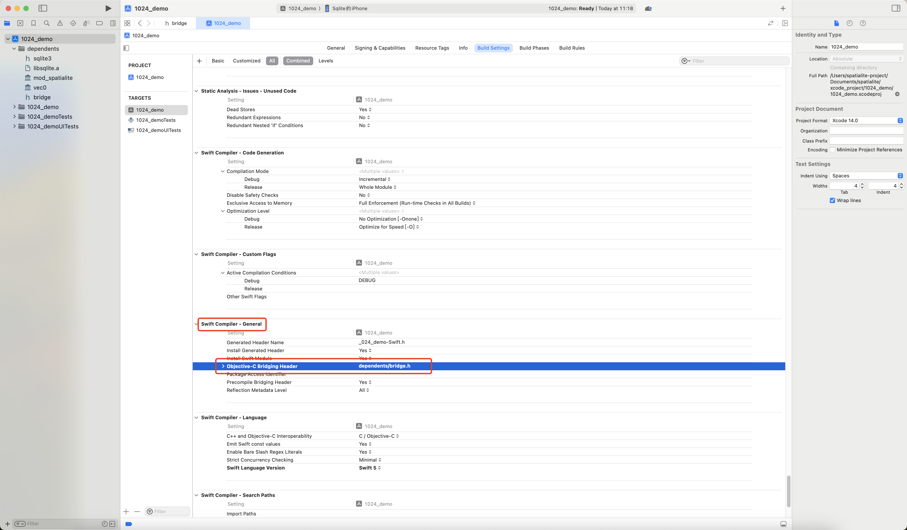

8. 设置项目签名。

    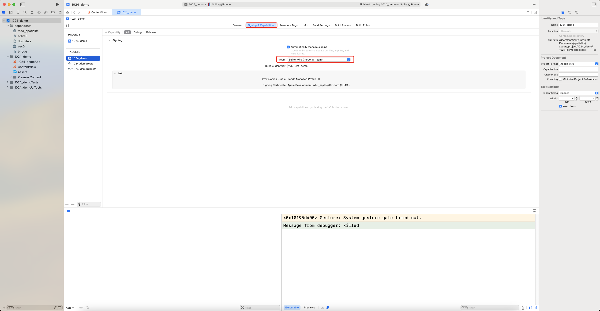

9. 动态库签名。

    如果是真机上运行的话，需要对动态库sqlite-vec.dylib、mod_spatialite.dylib签名，否则就会报错：

    ```
    'xxx.dylib' not valid for use in process: mapped file has no cdhash, completely unsigned? Code has to be at least ad-hoc signed.
    ```

    **签名方法：**

    打开Mac上的”钥匙串访问“（Keychain Access），找到开发者证书。

    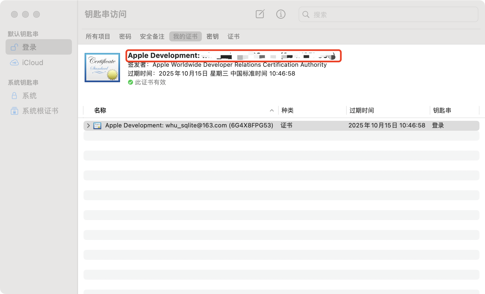

    在终端输入：

    ``` shell
    codesign -f -s "Apple Development: xxx" xxx.dylib
    ```

### 在项目中使用WhuDatabase

#### 打开数据库

1. 创建数据库指针。

    Swift：

    ``` swift
    var db: OpaquePointer?
    ```

    > OpaquePointer 是 Swift 中用于表示指向 C 语言中不透明数据结构的指针类型。

    OC：

    ``` objc
    sqlite3 *db;
    ```

2. 获取数据库文件的路径。

    > **注意：下面获取数据库文件路径的代码仅供参考，实际开发请按需修改。**

    Swift：

    ``` swift
    let fileURL = try! FileManager.default.url(for: .documentDirectory, in: .userDomainMask, appropriateFor: nil, create: false).appendingPathComponent("whudatabase.db")
    ```

    这段代码会得到数据库文件的路径fileURL。在这里，我们将数据库文件命名为“whudatabase.db”。

    OC：

    ``` objc
    NSError *error = nil;
    NSURL *documentsDirectory = [[NSFileManager defaultManager] URLForDirectory:NSDocumentDirectory inDomain:NSUserDomainMask appropriateForURL:nil create:NO error:&error];

    if (error) {
        // 处理错误
        NSLog(@"Error getting documents directory: %@", error);
    } else {
        NSURL *fileURL = [documentsDirectory URLByAppendingPathComponent:@"whudatabase.db"];
        // 使用 fileURL
    }
    ```

3. 打开数据库。

    Swift：

    ``` swift
    if sqlite3_open(fileURL.path, &db) != SQLITE_OK {
        result = "Unable to open database."
    }
    ```

    这段代码调用SQLite的API ``sqlite3_open()`` 来打开数据库。

    OC：

    ``` objc
    if (sqlite3_open([fileURL.path UTF8String], &db) != SQLITE_OK) {
        result = @"Unable to open database.";
    }
    ```

#### 加载扩展

1. 启用SQLite的动态加载扩展功能。

    Swift：

    ``` swift
    if sqlite3_enable_load_extension(db, 1) != SQLITE_OK {
        print("Error enabling load extension")
    }
    ```

    OC：
    ``` objc
    if (sqlite3_enable_load_extension(db, 1) != SQLITE_OK) {
        NSLog(@"Failed to enable extension loading: %s", sqlite3_errmsg(db));
    }
    ```

2. 加载需要的扩展，以加载mod_spatialite.dylib为例：

    Swift：

    ``` swift
    if sqlite3_load_extension(db, Bundle.main.path(forResource: "mod_spatialite", ofType: "dylib"), nil, nil) != SQLITE_OK {
        print("Error loading spatialite extension")
    }
    ```

    OC：

    ``` objc
    NSString *extensionPath = [[NSBundle mainBundle] pathForResource:@"mod_spatialite" ofType:@"dylib"];
    if (sqlite3_load_extension(db, [extensionPath UTF8String], NULL, NULL) != SQLITE_OK) {
        NSLog(@"Failed to load extension.");
    }
    ```

#### 基本SQLite API的使用

在打开数据库并加载扩展后，剩下的工作就是常规的SQLite操作流程了，只不过使用的是SQLite的C API。

1. 准备查询语句。

    在SQLite中，需要先调用``sqlite3_prepare_v2()``来准备SQL语句。

    以创建表为例：

    Swift：

    ```swift
    // 定义SQL语句
    let sql = """
    CREATE TABLE test (
        id INTEGER,
        name TEXT
    );
    """

    // 定义statement指针
    var statement: OpaquePointer?

    // 使用sqlite3_prepare_v2来准备SQL语句
    var rc = sqlite3_prepare_v2(db, sql, -1, &statement, nil)
    ```

    OC：

    ``` objc
    // 定义SQL语句
    const char *sql = "CREATE TABLE test (id INTEGER, name TEXT);";

    // 定义statement指针
    sqlite3_stmt *statement;

    // 使用sqlite3_prepare_v2来准备SQL语句
    int rc = sqlite3_prepare_v2(db, sql, -1, &statement, NULL);
    ```

2. 执行查询并解析查询结果。

    在准备好查询语句后，需要调用``sqlite3_step()``来执行查询和``sqlite3_column()``来解析查询结果。

    > 需要注意的是，``sqlite3_column()``并不是一个函数，而是一类函数。
    ``sqlite3_column_int()``用来解析整数值；``sqlite3_column_double()``用来获取浮点值；``sqlite3_column_text()``用来获取文本值......

    Swift：

    ``` swift
    // 首先判断sqlite3_prepare_v2()的返回值是否是成功
    if rc != SQLITE_OK {
        print("Error preparing tatement")
        // 省略错误处理
    }

    // 调用sqlite3_step()执行查询
    if sqlite3_step(statement) == SQLITE_DONE {
      print("Create table successfully")
    } else {
      // 错误处理
    }
    ```

    OC：

    ``` objc
    if (rc != SQLITE_OK) {
        NSLog(@"Failed to prepare Query.");
    }
    ```

    > 判断``sqlite3_step()``是否成功通常使用两个值来判断：``SQLITE_ROW``和``SQLITE_DONE``。``SQLITE_DONE``表示SQL语句执行完毕，没有更多的结果行可供返回。通常在执行``INSERT``、``UPDATE``或``DELETE`` 等语句时会返回这个状态，表示操作成功完成。``SQLITE_ROW``表示当前行的数据可供读取。当你执行 ``SELECT`` 查询时，若有结果行``sqlite3_step``会返回``SQLITE_ROW``，此时可以使用``sqlite3_column`` 系列函数来提取该行的数据。
    
    因为前面的例子是创建表，所以使用``SQLITE_DONE``，也不需要解析查询结果。下面再举一个``SELECT``操作的例子来演示解析查询结果。

    Swift：

    ``` swift
    var sql = """
    SELECT * FROM test;
    """
    var statement: OpaquePointer?
    if sqlite3_prepare_v2(db, sql, -1, &statement, nil) == SQLITE_OK {
        while sqlite3_step(statement) == SQLITE_ROW {
            let id = Int(sqlite3_column_int(statement, 0))
            let name = String(cString: sqlite3_column_text(statement, 1))
            // 根据程序需要处理id和name
        }
    }
    ```

    OC：

    ``` objc
    const char *sql = "select * from test;";
    sqlite3_stmt *statement;
    if (sqlite3_prepare_v2(db, sql, -1, &statement, NULL) == SQLITE_OK) {
        while (sqlite3_step(statement) == SQLITE_ROW) {
            int id = sqlite3_column_int(statement, 0);
            const char *nameText = (const char *)sqlite3_column_text(statement, 1);
            NSString *name = [NSString stringWithUTF8String:nameText];
            // 根据程序需要处理id和name
        }
    } 
    ```

3. 释放查询语句。

    在执行完查询后，一定要释放查询语句。

    Swift：

    ``` swift
    sqlite3_finalize(statement)
    ```

    OC：

    ``` objc
    sqlite3_finalize(statement);
    ```


#### 真实案例

下面的代码实现了一个简单的Whudatabase Shell，并且导入了sqlite-vec和spatialite两个扩展，使Whudatabase支持向量和图两种数据。

**Swift：**

在完成前面创建项目、配置项目后，将下面的代码复制到``ContentView.swift``中即可。

``` swift
//  ContentView.swift

import SwiftUI

// 视图模型
class SQLiteViewModel: ObservableObject {
    @Published var query: String = ""
    @Published var result: String = ""
    
    var db: OpaquePointer?
    
    init() {
        // 打开SQLite数据库
        let fileURL = try! FileManager.default.url(for: .documentDirectory, in: .userDomainMask, appropriateFor: nil, create: false).appendingPathComponent("whudatabase.db")
        if sqlite3_open(fileURL.path, &db) != SQLITE_OK {
            result = "Unable to open database."
        }
        // 启用加载扩展
        if sqlite3_enable_load_extension(db, 1) != SQLITE_OK {
            print("Error enabling load extension")
        }
        // 加载mod_spatialite.dylib
        load_spatialite()
        // 加载vec0.dylib
        load_vec()
    }
    
    func load_spatialite() {
        if sqlite3_load_extension(db, Bundle.main.path(forResource: "mod_spatialite", ofType: "dylib"), nil, nil) != SQLITE_OK {
            print("Error loading spatialite extension")
        }
    }
    
    func load_vec() {
        if sqlite3_load_extension(db, Bundle.main.path(forResource: "vec0", ofType: "dylib"), nil, nil) != SQLITE_OK {
            print("Error loading sqlite-vec extension")
        }
    }

    // 执行输入框里的查询语句（可能存在多条语句的情况）
    func runQuery() {
        guard !query.isEmpty else {
            result = "Please enter a query."
            return
        }
        
        // 处理多个查询语句
        let queries = query.split(separator: ";").map { $0.trimmingCharacters(in: .whitespaces) }
        var resultText = ""
        
        for sql in queries {
            if !sql.isEmpty {
                resultText += "Executing query: \(sql)\n\n"
                resultText += executeQuery(sql: sql) + "\n"
            }
        }
        
        result = resultText
    }
    
    // 执行单个查询语句
    func executeQuery(sql: String) -> String {
        var resultText = ""
        var statement: OpaquePointer?
        
        if sqlite3_prepare_v2(db, sql, -1, &statement, nil) == SQLITE_OK {
            while sqlite3_step(statement) == SQLITE_ROW {
                let columnCount = sqlite3_column_count(statement)
                for column in 0..<columnCount {
                    if let cString = sqlite3_column_text(statement, column) {
                        let value = String(cString: cString)
                        resultText += "\(value) "
                    }
                }
                resultText += "\n"
            }
            sqlite3_finalize(statement)
        } else {
            resultText = "Query failed: \(String(cString: sqlite3_errmsg(db)))"
        }
        
        return resultText
    }
    
    deinit {
        sqlite3_close(db)
    }
}

// SwiftUI 视图
struct ContentView: View {
    @StateObject private var viewModel = SQLiteViewModel()
    
    var body: some View {
        VStack {
            TextField("Enter SQL query", text: $viewModel.query)
                .textFieldStyle(RoundedBorderTextFieldStyle())
                .padding()
            
            Button("Run Query") {
                viewModel.runQuery()
            }
            .padding()
            
            ScrollView {
                Text(viewModel.result)
                    .padding()
            }
        }
        .padding()
    }
}

#Preview {
    ContentView()
}
```

**OC：**

按照下面代码修改``ViewController.h``和``ViewController.m``的代码。

还需要在Main.storyboard中自行添加输入框、输出框、按钮，并和对应代码绑定。

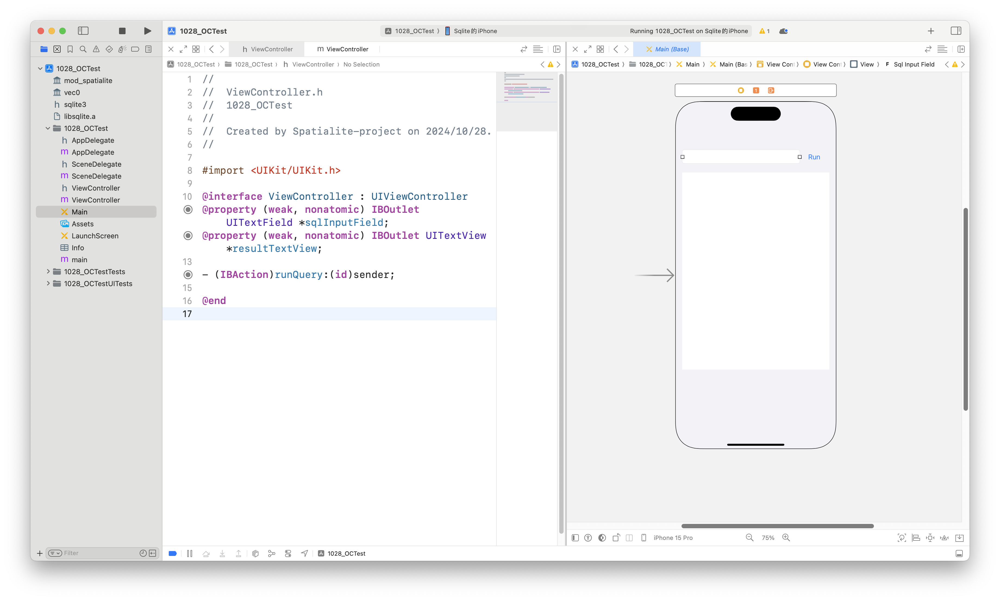

``` objc
// ViewController.h

#import <UIKit/UIKit.h>

@interface ViewController : UIViewController
@property (weak, nonatomic) IBOutlet UITextField *sqlInputField;
@property (weak, nonatomic) IBOutlet UITextView *resultTextView;

- (IBAction)runQuery:(id)sender;

@end

```

``` objc
// ViewController.m

#import "ViewController.h"
#import "sqlite3.h"

@interface ViewController () {
    sqlite3 *db;
}

@end

@implementation ViewController

- (void)viewDidLoad {
    [super viewDidLoad];
    
    NSError *error = nil;
    NSURL *documentsDirectory = [[NSFileManager defaultManager] URLForDirectory:NSDocumentDirectory inDomain:NSUserDomainMask appropriateForURL:nil create:NO error:&error];

    if (error) {
        // 处理错误
        NSLog(@"Error getting documents directory: %@", error);
    } else {
        NSURL *fileURL = [documentsDirectory URLByAppendingPathComponent:@"whudatabase.db"];
        // 打开数据库
        if (sqlite3_open([fileURL.path UTF8String], &db) != SQLITE_OK) {
            NSLog(@"Failed to open database");
            return;
        }
    }
    
    // 加载扩展
    NSString *extensionPath = [[NSBundle mainBundle] pathForResource:@"mod_spatialite" ofType:@"dylib"];
    if (![self loadSQLiteExtension:extensionPath]) {
        return;
    }
    extensionPath = [[NSBundle mainBundle] pathForResource:@"vec0" ofType:@"dylib"];
    if (![self loadSQLiteExtension:extensionPath]) {
        return;
    }
}

- (BOOL)loadSQLiteExtension:(NSString *)extensionPath {
    if (sqlite3_enable_load_extension(db, 1) != SQLITE_OK) {
        NSLog(@"Failed to enable extension loading: %s", sqlite3_errmsg(db));
        return NO;
    }

    if (sqlite3_load_extension(db, [extensionPath UTF8String], NULL, NULL) != SQLITE_OK) {
        NSLog(@"Failed to load extension.");
        return NO;
    }

    NSLog(@"Extension loaded successfully");
    return YES;
}

- (IBAction)runQuery:(id)sender {
    NSString *query = self.sqlInputField.text;
    NSArray *queries = [query componentsSeparatedByString:@";"]; // 以分号分隔多个查询
    NSMutableString *finalResult = [NSMutableString string];

    for (NSString *sql in queries) {
        NSString *trimmedSQL = [sql stringByTrimmingCharactersInSet:[NSCharacterSet whitespaceCharacterSet]];
        if (trimmedSQL.length > 0) {
            NSString *result = [self executeQuery:trimmedSQL]; // 调用 executeQuery 并获取结果
            [finalResult appendString:result]; // 将每个结果累加
        }
    }

    self.resultTextView.text = finalResult; // 更新文本视图
}


- (NSString *)executeQuery:(NSString *)sql {
    sqlite3_stmt *statement;
    NSMutableString *result = [NSMutableString string];

    if (sqlite3_prepare_v2(db, [sql UTF8String], -1, &statement, NULL) == SQLITE_OK) {
        while (sqlite3_step(statement) == SQLITE_ROW) {
            int columnCount = sqlite3_column_count(statement);
            for (int i = 0; i < columnCount; i++) {
                const char *columnText = (const char *)sqlite3_column_text(statement, i);
                if (columnText) {
                    [result appendFormat:@"%s\t", columnText];
                }
            }
            [result appendString:@"\n"];
        }
        [result appendString:@"OK\n"];
    } else {
        NSLog(@"Failed to prepare query: %s", sqlite3_errmsg(db));
        [result appendFormat:@"Error: %s\n", sqlite3_errmsg(db)];
    }

    sqlite3_finalize(statement);
    return result; // 返回查询结果
}


- (void)dealloc {
    sqlite3_close(db);
}

@end

```

## Whudatabase进阶

上个部分介绍了Whudatabase最基础的操作，这一部分将更进一步，介绍向量、文档、图在Whudatabase中的操作。

由于Whudatabase是基于SQLite开发的，所以支持SQLite原有所有的功能。在加入sqlite-vec和Spatialite后，Whudatabase相较于SQLite，新增了向量和图的一些功能。

后面我们分别介绍向量、文档和图的操作。

### 向量型数据

参考阅读：[API Reference | sqlite-vec](https://alexgarcia.xyz/sqlite-vec/api-reference.html)

#### 向量构造器

构造器是一类用来构造向量SQL函数。目前，sqlite-vec扩展支持``float32``，``int8``，``bit``这三种类型的向量。

1. ``vec_f32(vector)``

    从BLOB或JSON文本创建一个浮点向量。如果从BLOB创建，长度必须被4字节整除（因为浮点数使用4字节）。
    
    函数的返回值是一个BLOB，每个元素占4字节。

    > 返回值的类型是223子类型。子类型（[subtype](https://www.sqlite.org/c3ref/result_subtype.html)）是SQLite的一个机制。

    ``` sql
    select vec_f32('[.1, .2, .3, 4]');
    -- X'CDCCCC3DCDCC4C3E9A99993E00008040'

    select subtype(vec_f32('[.1, .2, .3, 4]'));
    -- 223

    select vec_f32(X'AABBCCDD');
    -- X'AABBCCDD'

    select vec_to_json(vec_f32(X'AABBCCDD'));
    -- '[-1844071490169864000.000000]'

    select vec_f32(X'AA');
    -- ❌ invalid float32 vector BLOB length. Must be divisible by 4, found 1
    ```

2. ``vec_int8(vector)``

    如果vector是BLOB，长度必须是4字节的倍数。如果vector是JSON，每个元素必须是-128-127之间的整数。

    函数的返回值是BLOB，每个元素占1字节。

    ``` sql
    select vec_int8('[1, 2, 3, 4]');
    -- X'01020304'

    select subtype(vec_int8('[1, 2, 3, 4]'));
    -- 225

    select vec_int8(X'AABBCCDD');
    -- X'AABBCCDD'

    select vec_to_json(vec_int8(X'AABBCCDD'));
    -- '[-86,-69,-52,-35]'

    select vec_int8('[999]');
    -- ❌ JSON parsing error: value out of range for int8
    ```

3. ``vec_bit(vector)``

    vector必须是BLOB。

    返回值是一个BLOB，每个字节包含8个元素。

    ``` sql
    select vec_bit(X'F0');
    -- X'F0'

    select subtype(vec_bit(X'F0'));
    -- 224

    select vec_to_json(vec_bit(X'F0'));
    -- '[0,0,0,0,1,1,1,1]'
    ```

#### 向量操作

1. ``vec_length(vector)``

    返回vector的元素个数。vector可以是JSON，BLOB或构造器的结果。

    如果vector是无效的，函数返回一个错误。

    ``` sql
    select vec_length('[.1, .2]');
    -- 2

    select vec_length(X'AABBCCDD');
    -- 1

    select vec_length(vec_int8(X'AABBCCDD'));
    -- 4

    select vec_length(vec_bit(X'AABBCCDD'));
    -- 32

    select vec_length(X'CCDD');
    -- ❌ invalid float32 vector BLOB length. Must be divisible by 4, found 2
    ```

2. ``vec_type(vector)``

    返回vector的类型（float32，int8或bit）。如果vector无效，返回一个错误。

    ``` sql
    select vec_type('[.1, .2]');
    -- 'float32'

    select vec_type(X'AABBCCDD');
    -- 'float32'

    select vec_type(vec_int8(X'AABBCCDD'));
    -- 'int8'

    select vec_type(vec_bit(X'AABBCCDD'));
    -- 'bit'

    select vec_type(X'CCDD');
    -- ❌ invalid float32 vector BLOB length. Must be divisible by 4, found 2
    ```

3. ``vec_add(a, b)``

    将向量a和向量b相加，返回一个新的向量c。两个向量的类型和长度必须相同。只支持float32和int8两种类型的向量。

    ``` sql
    select vec_add(
        '[.1, .2, .3]',
        '[.4, .5, .6]'
    );
    -- X'0000003F3333333F6766663F'

    select vec_to_json(
    vec_add(
        '[.1, .2, .3]',
        '[.4, .5, .6]'
    )
    );
    -- '[0.500000,0.700000,0.900000]'

    select vec_to_json(
    vec_add(
        vec_int8('[1, 2, 3]'),
        vec_int8('[4, 5, 6]')
    )
    );
    -- '[5,7,9]'

    select vec_add('[.1]', vec_int8('[1]'));
    -- ❌ Vector type mistmatch. First vector has type float32, while the second has type int8.

    select vec_add(vec_bit(X'AA'), vec_bit(X'BB'));
    -- ❌ Cannot add two bitvectors together.
    ```

4. ``vec_sub(a, b)``

    向量a减去向量b，返回一个新的向量c。限制条件和``vec_add()``相同。

    ``` sql
    select vec_sub(
        '[.1, .2, .3]',
        '[.4, .5, .6]'
    );
    -- X'9A9999BE9A9999BE9A9999BE'

    select vec_to_json(
    vec_sub(
        '[.1, .2, .3]',
        '[.4, .5, .6]'
    )
    );
    -- '[-0.300000,-0.300000,-0.300000]'

    select vec_to_json(
    vec_sub(
        vec_int8('[1, 2, 3]'),
        vec_int8('[4, 5, 6]')
    )
    );
    -- '[-3,-3,-3]'

    select vec_sub('[.1]', vec_int8('[1]'));
    -- ❌ Vector type mistmatch. First vector has type float32, while the second has type int8.

    select vec_sub(vec_bit(X'AA'), vec_bit(X'BB'));
    -- ❌ Cannot subtract two bitvectors together.
    ```

5. ``vec_normalize(vector)``

    对vector执行L2归一化。目前支持float32类型的向量。

    ``` sql
    select vec_normalize('[2, 3, 1, -4]');
    -- X'BAF4BA3E8B370C3FBAF43A3EBAF43ABF'

    select vec_to_json(
    vec_normalize('[2, 3, 1, -4]')
    );
    -- '[0.365148,0.547723,0.182574,-0.730297]'

    -- for matryoshka embeddings - slice then normalize
    select vec_to_json(
    vec_normalize(
        vec_slice('[2, 3, 1, -4]', 0, 2)
    )
    );
    -- '[0.554700,0.832050]'
    ```

6. ``vec_slice(vector, start, end)``

    对vector进行切片，从start（包括）到end（不包括）。

    ``` sql
    select vec_slice('[1, 2,3, 4]', 0, 2);
    -- X'0000803F00000040'

    select vec_to_json(
    vec_slice('[1, 2,3, 4]', 0, 2)
    );
    -- '[1.000000,2.000000]'

    select vec_to_json(
    vec_slice('[1, 2,3, 4]', 2, 4)
    );
    -- '[3.000000,4.000000]'

    select vec_to_json(
    vec_slice('[1, 2,3, 4]', -1, 4)
    );
    -- ❌ slice 'start' index must be a postive number.

    select vec_to_json(
    vec_slice('[1, 2,3, 4]', 0, 5)
    );
    -- ❌ slice 'end' index is greater than the number of dimensions

    select vec_to_json(
    vec_slice('[1, 2,3, 4]', 0, 0)
    );
    -- ❌ slice 'start' index is equal to the 'end' index, vectors must have non-zero length
    ````

7. ``vec_to_json(vector)``

    将向量表示为JSON文本。vector可以是BLOB或JSON。

    ``` sql
    select vec_to_json(X'AABBCCDD');
    -- '[-1844071490169864000.000000]'

    select vec_to_json(vec_int8(X'AABBCCDD'));
    -- '[-86,-69,-52,-35]'

    select vec_to_json(vec_bit(X'AABBCCDD'));
    -- '[0,1,0,1,0,1,0,1,1,1,0,1,1,1,0,1,0,0,1,1,0,0,1,1,1,0,1,1,1,0,1,1]'

    select vec_to_json('[1,2,3,4]');
    -- '[1.000000,2.000000,3.000000,4.000000]'

    select vec_to_json('invalid');
    -- ❌ JSON array parsing error: Input does not start with '['
    ```

#### 距离函数

计算两个向量之间的距离。

1. ``vec_distance_L2(a, b)``

    计算向量a和向量b之间的L2欧几里得距离。只能用于float32和int8类型的向量。

    ``` sql
    select vec_distance_L2('[1, 1]', '[2, 2]');
    -- 1.4142135381698608

    select vec_distance_L2('[1, 1]', '[-2, -2]');
    -- 4.242640495300293

    select vec_distance_L2('[1.1, 2.2, 3.3]', '[4.4, 5.5, 6.6]');
    -- 5.7157673835754395

    select vec_distance_L2(X'AABBCCDD', X'00112233');
    -- 1844071490169864200

    select vec_distance_L2('[1, 1]', vec_int8('[2, 2]'));
    -- ❌ Vector type mistmatch. First vector has type float32, while the second has type int8.

    select vec_distance_L2(vec_bit(X'AA'), vec_bit(X'BB'));
    -- ❌ Cannot calculate L2 distance between two bitvectors.
    ```

2. ``vec_distance_cosine(a, b)``

    计算向量a和向量b之间的余弦距离。只能用于float32和int8类型的向量。

    ``` sql
    select vec_distance_cosine('[1, 1]', '[2, 2]');
    -- 2.220446049250313e-16

    select vec_distance_cosine('[1, 1]', '[-2, -2]');
    -- 2

    select vec_distance_cosine('[1.1, 2.2, 3.3]', '[4.4, 5.5, 6.6]');
    -- 0.02536807395517826

    select vec_distance_cosine(X'AABBCCDD', X'00112233');
    -- 2

    select vec_distance_cosine('[1, 1]', vec_int8('[2, 2]'));
    -- ❌ Vector type mistmatch. First vector has type float32, while the second has type int8.

    select vec_distance_cosine(vec_bit(X'AA'), vec_bit(X'BB'));
    -- ❌ Cannot calculate cosine distance between two bitvectors.
    ```

3. ``vec_distance_hamming(a, b)``

    求比特向量a和比特向量b之间的汉明距离。只能用于bit类型的向量。

    ``` sql
    select vec_distance_hamming(vec_bit(X'00'), vec_bit(X'FF'));
    -- 8

    select vec_distance_hamming(vec_bit(X'FF'), vec_bit(X'FF'));
    -- 0

    select vec_distance_hamming(vec_bit(X'F0'), vec_bit(X'44'));
    -- 4

    select vec_distance_hamming('[1, 1]', '[0, 0]');
    -- ❌ Cannot calculate hamming distance between two float32 vectors.
    ```

#### KNN（K-最近邻）

``` sql
create virtual table vec_examples using vec0(
  sample_embedding float[8]
);

-- vectors can be provided as JSON or in a compact binary format
insert into vec_examples(rowid, sample_embedding)
  values
    (1, '[-0.200, 0.250, 0.341, -0.211, 0.645, 0.935, -0.316, -0.924]'),
    (2, '[0.443, -0.501, 0.355, -0.771, 0.707, -0.708, -0.185, 0.362]'),
    (3, '[0.716, -0.927, 0.134, 0.052, -0.669, 0.793, -0.634, -0.162]'),
    (4, '[-0.710, 0.330, 0.656, 0.041, -0.990, 0.726, 0.385, -0.958]');


-- KNN style query
select
  rowid,
  distance
from vec_examples
where sample_embedding match '[0.890, 0.544, 0.825, 0.961, 0.358, 0.0196, 0.521, 0.175]'
order by distance
limit 2;
/*
┌───────┬──────────────────┐
│ rowid │     distance     │
├───────┼──────────────────┤
│ 2     │ 2.38687372207642 │
│ 1     │ 2.38978505134583 │
└───────┴──────────────────┘
*/
```

更多请参考[KNN queries](https://alexgarcia.xyz/sqlite-vec/features/knn.html)

#### 向量量化

通过降低精度和准确性来压缩向量。

``vec_quantize_binary(vector)``：

将float32或int8类型的向量量化为bit类型的向量。对于vector中的每个元素，正数被赋为1，负数被赋为0。然后，返回一个bit类型的向量。

``` sql
select vec_quantize_binary('[1, 2, 3, 4, 5, 6, 7, 8]');
-- X'FF'

select vec_quantize_binary('[1, 2, 3, 4, -5, -6, -7, -8]');
-- X'0F'

select vec_quantize_binary('[-1, -2, -3, -4, -5, -6, -7, -8]');
-- X'00'

select vec_quantize_binary('[-1, -2, -3, -4, -5, -6, -7, -8]');
-- X'00'

select vec_quantize_binary(vec_int8(X'11223344'));
-- ❌ Binary quantization requires vectors with a length divisible by 8

select vec_quantize_binary(vec_bit(X'FF'));
-- ❌ Can only binary quantize float or int8 vectors
```

### 文档型数据

SQLite原生支持文档型数据，不需要导入扩展。

参考阅读：[JSON Functions And Operators](https://sqlite.org/json1.html#jmini)

下面是一个简单的例子演示json格式数据的插入与更新：

``` sql
-- 创建表格
CREATE TABLE my_table (
    id INTEGER PRIMARY KEY,
    data TEXT
);

-- 插入数据
INSERT INTO my_table (data) VALUES ('{"name": "John", "age": 30}');

-- 更新数据 (将 id 为1的 age 字段更新为31)
UPDATE my_table
SET data = json_set(data, '$.age', 31)
WHERE id = 1;

-- 删除数据 (删除 id 为1的 age 字段)
UPDATE my_table
SET data = json_remove(data, '$.age')
WHERE id = 1;
```

### 空间和图模型数据

#### 空间数据

##### 创建表和插入数据

``` sql
-- 创建表格
CREATE TABLE places (
    id INTEGER PRIMARY KEY,
    name TEXT,
    geom GEOMETRY
);

-- 插入点数据
INSERT INTO places (name, geom) VALUES ('Place A', GeomFromText('POINT(1 1)', 4326));
INSERT INTO places (name, geom) VALUES ('Place B', GeomFromText('POINT(2 2)', 4326));

-- 插入线数据
INSERT INTO places (name, geom) VALUES ('Line A', GeomFromText('LINESTRING(0 0, 2 2)', 4326));
INSERT INTO places (name, geom) VALUES ('Line B', GeomFromText('LINESTRING(0 2, 2 0)', 4326));

-- 插入多边形数据
INSERT INTO places (name, geom) VALUES ('Polygon A', GeomFromText('POLYGON((0 0, 0 3, 3 3, 3 0, 0 0))', 4326));
```
##### 基本查询

查询所有数据并显示几何对象的文本表示。

``` sql
SELECT id, name, AsText(geom) FROM places;
```
##### 空间查询

查询包含特定点的几何对象。

``` sql
SELECT name FROM places WHERE Contains(geom, GeomFromText('POINT(1 1)', 4326));
```

查询相交的几何对象。

``` sql
-- 两条线是否相交
SELECT Intersects(
    (SELECT geom FROM places WHERE name = 'Line A'),
    (SELECT geom FROM places WHERE name = 'Line B')
) AS do_intersect;

-- 与一条线相交的几何对象
SELECT name FROM places WHERE Intersects(geom, GeomFromText('LINESTRING(0 0, 2 2)', 4326));
```

查询距离。

``` sql
-- 两点之间的距离
SELECT Distance(
    (SELECT geom FROM places WHERE name = 'Place A'),
    (SELECT geom FROM places WHERE name = 'Place B')
) AS distance;

-- 距离特定点一定范围内的几何对象
SELECT name FROM places WHERE Distance(geom, GeomFromText('POINT(1 1)', 4326)) < 2.0;
```
##### 几何操作

旨在加快时空数据的搜索效率，服务于数据分析和机器学习模型训练。

``` sql
SELECT id, name, AsText(Buffer(geom, 1.0)) AS buffered_geom FROM places;
```
计算几何对象的凸包。

```sql
SELECT id, name, AsText(ConvexHull(geom)) AS convex_hull_geom FROM places;
```

#### 图模型数据

Whudatabase利用Spatialtie的[VirtualRouting](https://www.gaia-gis.it/fossil/libspatialite/wiki?name=VirtualRouting)模块，支持了一些图算子，如最短路径的计算。

下面是计算最短路径的一个例子：

``` sql
-- 创建表edge，id是边的id，node_from是边的起点，node_to是边的终点，cost是边的长度，name是边的名字
create table edge(
  id integer primary key autoincrement,
  node_from integer not null,
  node_to integer not null,
  cost double not null,
  name text unique
);

-- 插入边
insert into edge values (1, 1, 2, 1, 'one'),
                        (2, 2, 3, 1, 'two'),
                        (3, 3, 4, 1, 'three'),
                        (4, 1, 5, 1, 'four'),
                        (5, 5, 6, 1, 'five'),
                        (6, 6, 7, 1, 'six'),
                        (7, 7, 4, 1, 'seven'),
                        (8, 5, 4, 1, 'eight');

-- 计算最短路径
select CreateRouting('_edge_data', '_edge', 'edge', 'node_from', 'node_to', NULL, 'cost', 'name', 0, 1);

-- 查询从节点1到节点4的最短路径
select * from _edge where NodeFrom = 1 and NodeTo = 4;
```