<div style="text-align: center; font-size: 60px; font-weight: bold; font-style: italic; font-family: 'Courier New', Courier, monospace;">
  WhuDatabase-Android
</div>

# 介绍
WhuDatabase-Android是WhuDatabase的安卓版本，是一个可在安卓设备上部署的多模数据库。WhuDatabase-Android目前支持关系型数据、向量型数据、文档型数据以及空间数据。

WhuDatabase-Android基于SQLite实现。SQLite是一个开源的关系型数据库，被广泛应用于手机等嵌入式设备。我们利用SQLite的扩展机制，通过在SQLite运行时加载android-whu-2.0.1扩展，来支持多模数据。下面是对相关扩展的简单介绍：

* android-whu-2.0.1：一个开源的安卓扩展包，可以让SQLite支持向量和空间数据。

# 使用方法

这一部分介绍如何在iOS开发中使用WhuDatabase-iOS。

## 开发工具

* Android Studio：电脑上必须安装Android Studio和相关开发套件。

* 安卓手机：真机测试需要在安卓手机上进行。

## WhuDatabase-Android重要组件

* android-whu-2.3.aar：SQLite的扩展包。

* libvec0.so：可以加载到aar包中的向量扩展包。

## 快速上手

以真机为例，介绍如何在真实项目中使用WhuDatabase。

### 创建项目

1. 打开Android Studio，选择"Create New Project..."。

    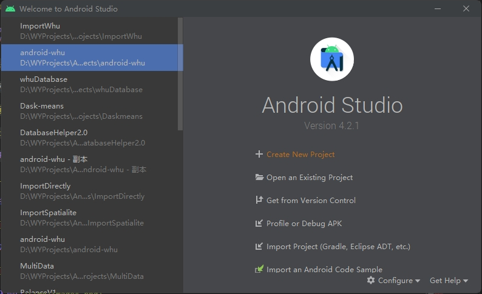

2. 选择“Phone and Tablet” -> “Empty Activity”。

    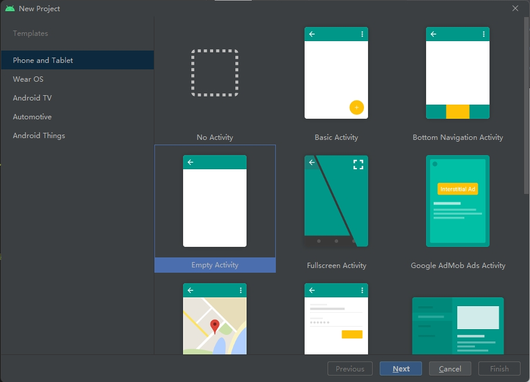

3. 输入项目信息，Language选择"Java"，Minimum SDK选择“API 28”。

    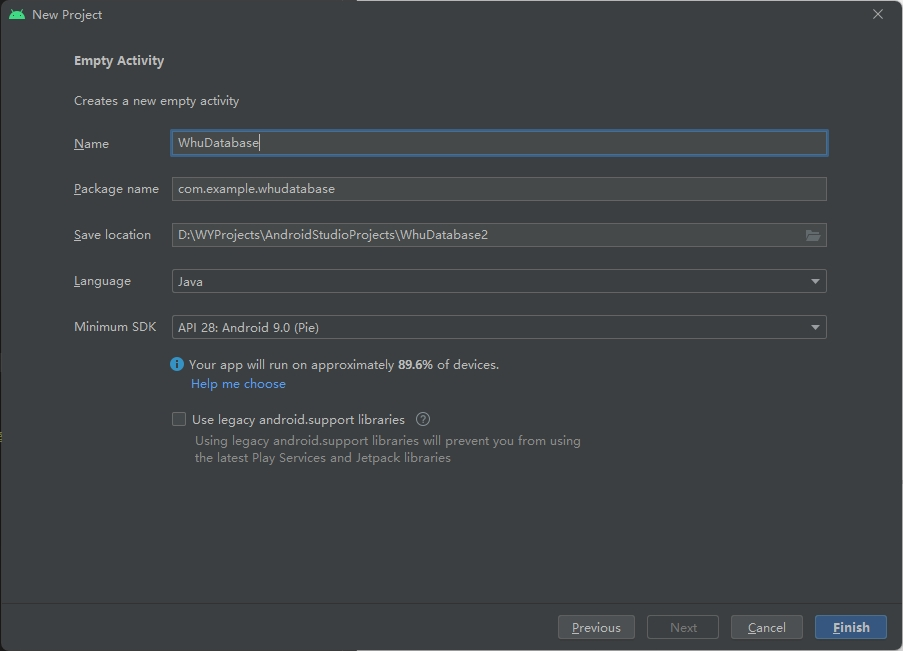

4. 选择项目保存路径后进入项目。

    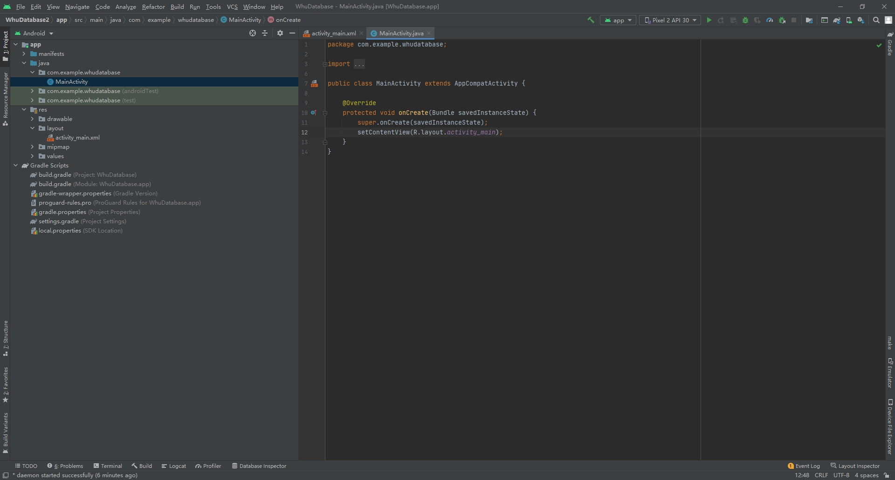

5. 连接设备。

    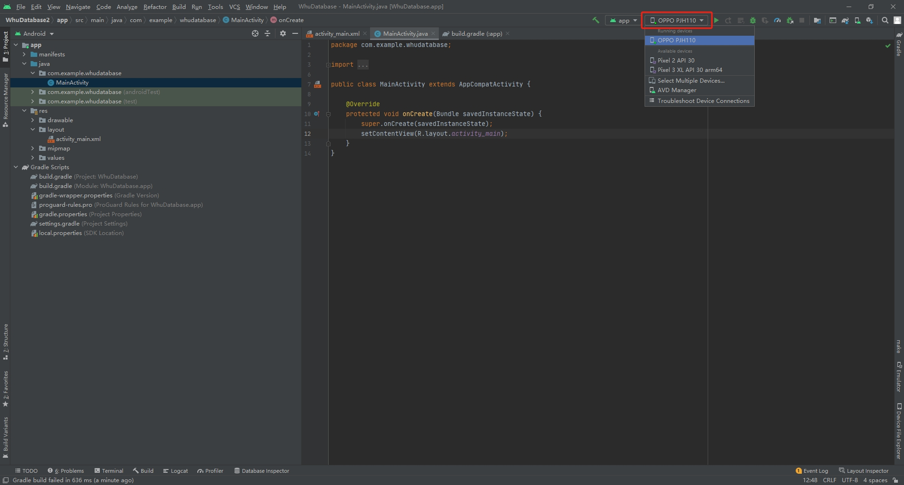

6. 点击“▶️”构建并运行项目。确保项目可以在iPhone上成功运行。

    <div style="text-align: center;">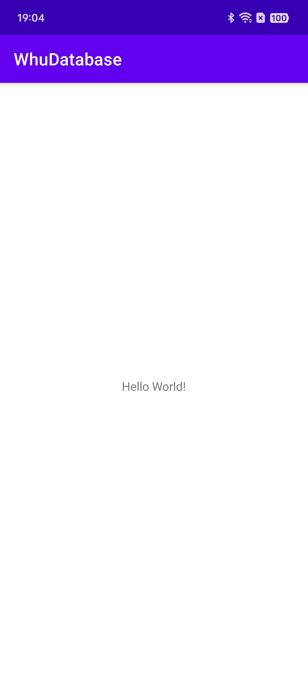</div>

### 配置项目

1. 将项目的视角调整为Project视角

    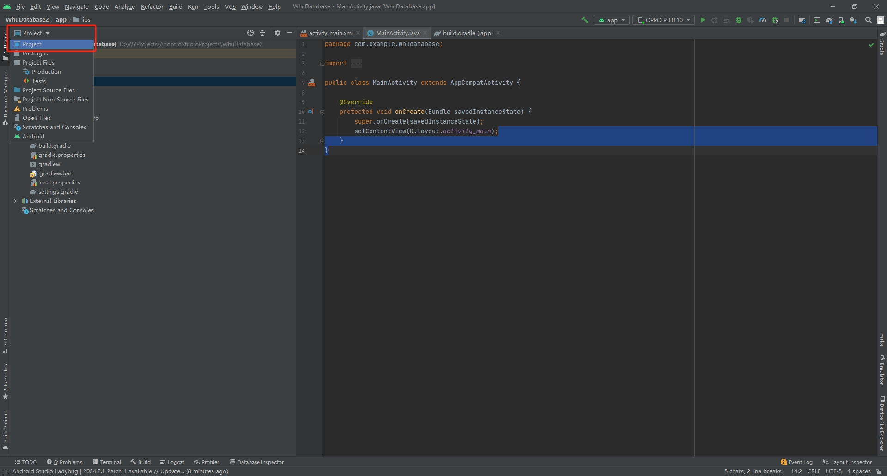

2. 将android-whu-2.3.aar扩展包放到/app/libs文件夹下

    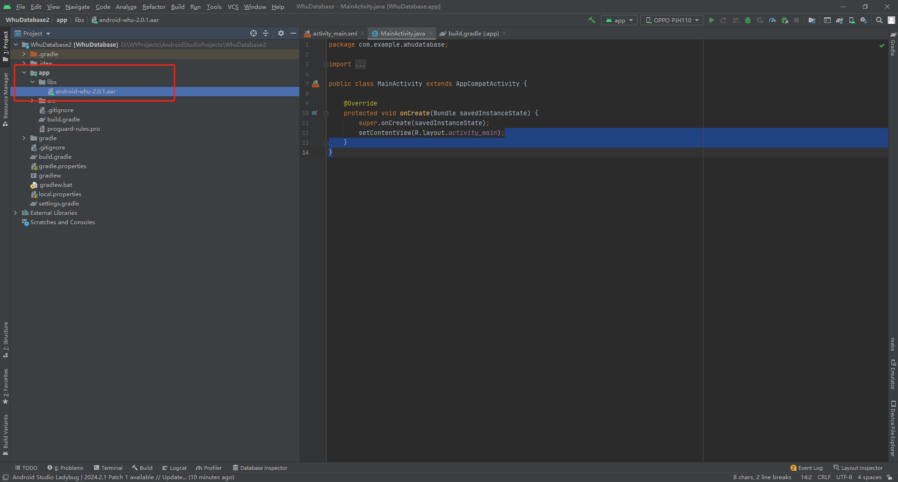

3. 在build.gradle(:app)中修改三个部分

    * 在dependencies｛｝中添加下列语句。

    ```java
    // 加载aar包
    implementation files('libs/android-whu-2.3.aar')
    ```

    * 在最外层添加下列语句。
    
    ```java
    repositories {
      flatDir {
        dirs 'libs'
      }
    }
    ```

    * 更改compileSdkVersion, targetSdkVersion和minSdkVersion，删掉buildToolsVersion

    ```java
    compileSdkVersion 29
    defaultConfig {
        minSdkVersion 28
        targetSdkVersion 29
    }
    ```

4. 更改之后需要同步build.gradle文件，点击“Sync Now”来同步

    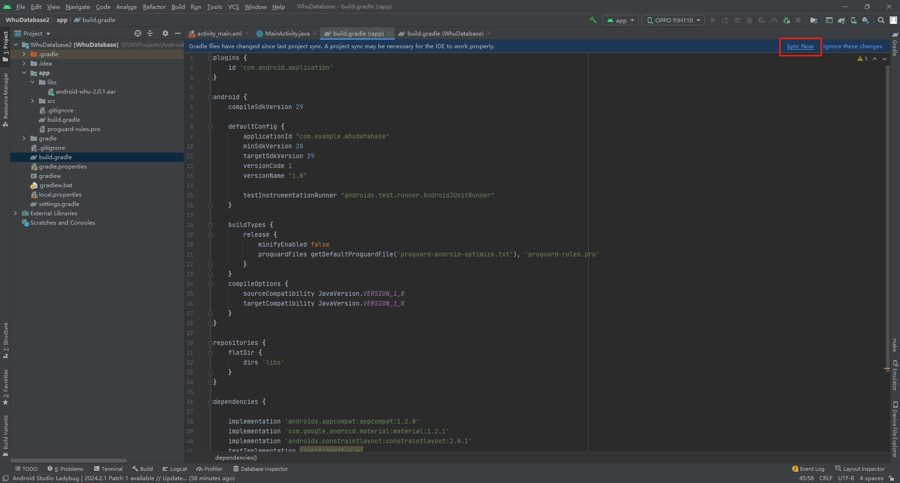

5. 点击右上角的SDK Manager并下载API 29，点击Apply以应用到程序中

    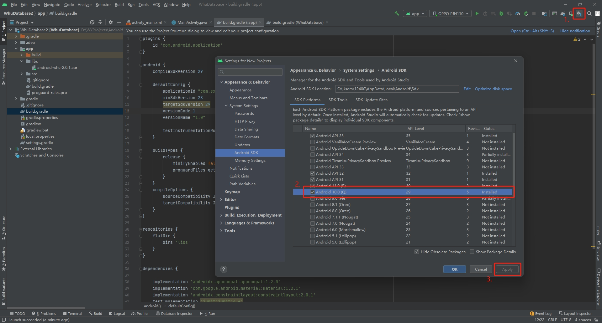

### 在项目中使用WhuDatabase

1. 在app/src/main/java/com.example.your_project下右键新建一个Java Class并命名为DataBaseHelper

    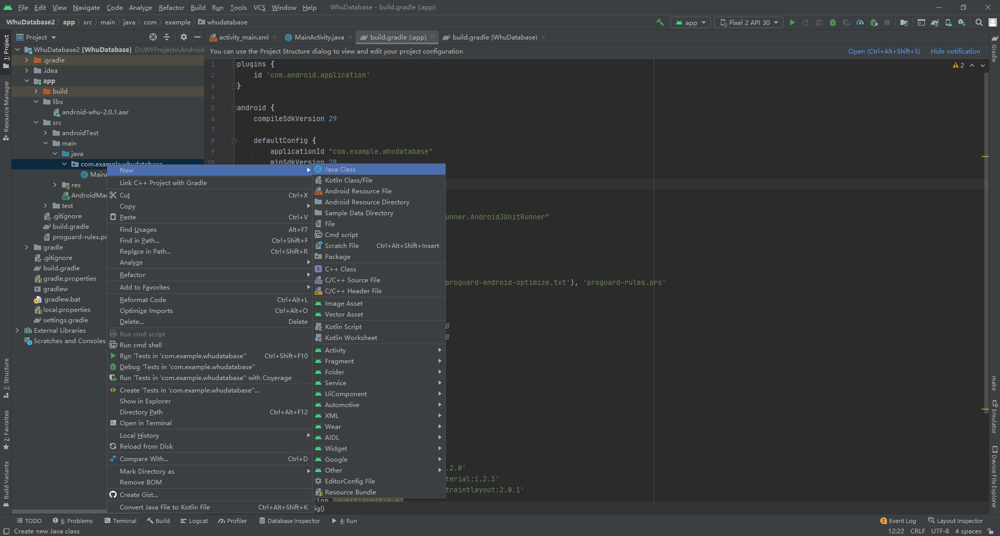

2. 在DatabaseHelper.java中写入以下内容来管理数据库

    ```java
    package com.example.importwhu;

    import android.content.Context;
    import android.database.Cursor;
    import android.util.Log;

    import org.sqlite.database.sqlite.SQLiteDatabase;
    import org.sqlite.database.sqlite.SQLiteOpenHelper;

    import java.io.File;

    public class DatabaseHelper extends SQLiteOpenHelper {

        private static final String DATABASE_NAME = "test.db"; // 数据库名称
        private static final int DATABASE_VERSION = 1;         // 数据库版本
        private Context context;
        public String loadSoFile = "";                         // 加载so库的语句

        public DatabaseHelper(Context context) {
            super(context, DATABASE_NAME, null, DATABASE_VERSION);
            this.context = context;
            initializeDatabase();
        }

        @Override
        public void onCreate(SQLiteDatabase db) {
            // 在这里创建你的数据库表结构
            Log.d("Whu", "Database created");
            initializeDatabase();
        }

        @Override
        public void onUpgrade(SQLiteDatabase db, int oldVersion, int newVersion) {
            // 如果数据库版本更新，这里可以处理升级逻辑
            onCreate(db);
        }

        public void initializeDatabase() {
            Log.d("Whu", "initializeDatabase");
            File databaseFile = new File(context.getDatabasePath(DATABASE_NAME).getAbsolutePath());
            SQLiteDatabase db = SQLiteDatabase.openOrCreateDatabase(databaseFile, null);

            // 启用扩展加载功能
            db.enableWriteAheadLogging();

            // 获取扩展包路径
            File soFile = new File(context.getFilesDir(), "libvec0.so");
            loadSoFile = "SELECT load_extension('" + soFile.getAbsolutePath() + "');";
        }

        // 执行非查询SQL命令（如 INSERT、UPDATE、DELETE 等）
        public void executeSQL(String sql) {
            SQLiteDatabase db = this.getWritableDatabase();
            db.execSQL(sql);
        }

        // 执行查询 SQL 命令，并返回 Cursor 结果
        public Cursor querySQL(String sql) {
            SQLiteDatabase db = this.getReadableDatabase();
            return db.rawQuery(sql, null);
        }

        // 执行扩展加载语句
        public void loadExtension() {
            SQLiteDatabase db = this.getWritableDatabase();
            db.execSQL(loadSoFile);
        }
    }
    ```

3. 需要在页面上添加两个输入框用来执行数据库创建语句和查询语句，双击src/main/res/layout/activity_main.xml，并点击右上角的split图标，可以看到左边是代码，右边是模拟画面。我们需要在Text中选中Plain Text，并将其拖入模拟画面中，选中边框以调整输入框的大小和位置

    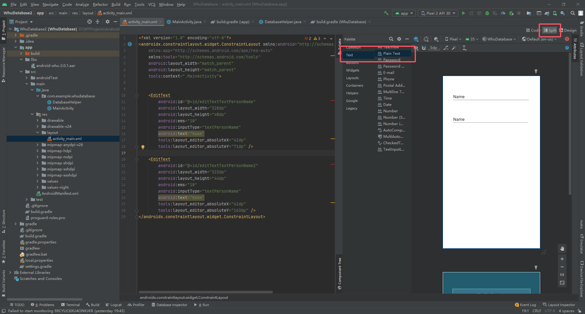

4. 将两个EditText的id更改为如图所示，并将text改为hint并输入想要的提示信息

    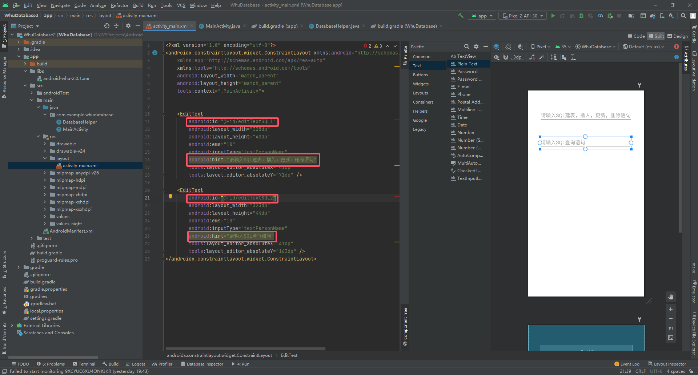

5. 还需要在页面上添加两个按钮来分别执行用户输入的两种语句，在Buttons中选中Button并拖入模拟画面中，选中边框以调整输入框的大小和位置

    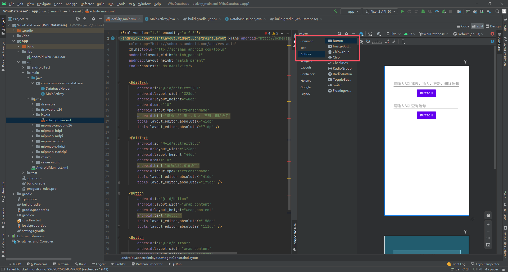

6. 将两个Button的id更改为如图所示，并将text改为想要显示在按钮上的文字

    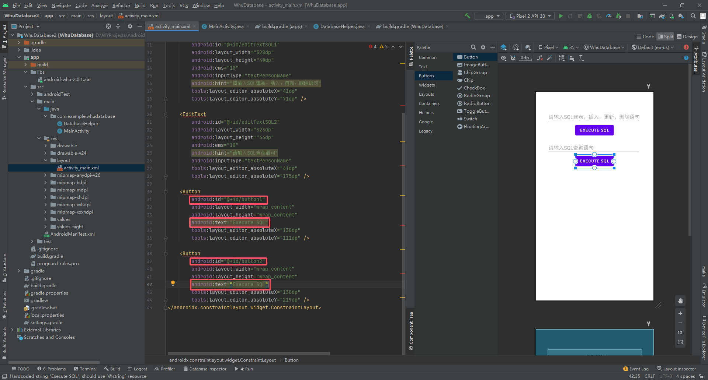

7. 由于我们整个页面使用的是ConstraintLayout，需要将每个小组件的四条边都固定好。如图所示，我们将第一个EditText的四条边上的圆点连接到了页面的上、左、右以及第一个Button的上边缘，这就代表第一个EditText已经固定好了，另外的组件也用这个方法固定直到红色感叹号消失。固定之后再慢慢调整组件位置

    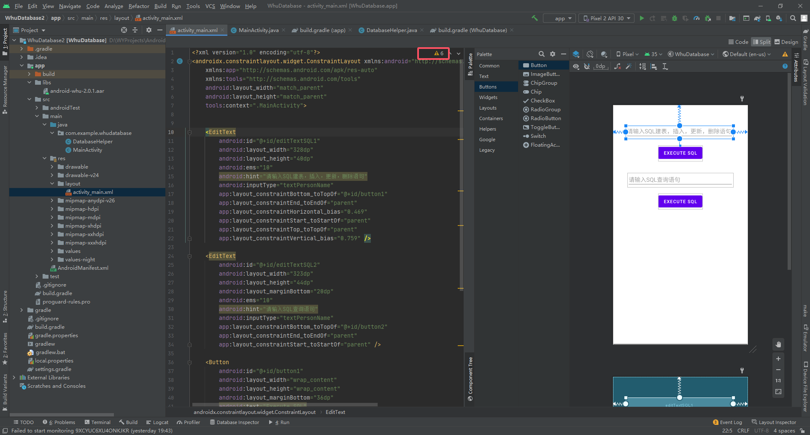

8. 由于我们还需要一个方框用来显示我们查询得到的结果，需要添加一个包含TextView的ScrollView。同时，添加后也将ScrollView固定好，至此我们的activity_main.xml就配置好了

    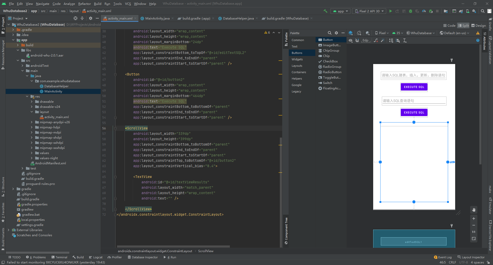

9. 接下来我们需要在MainActivity中为这些组件加上互动效果并实现它们的功能。首先，将需要用到的库导入到MainActivity中

    ```java
    import android.database.Cursor;
    import android.os.Bundle;
    import android.view.View;
    import android.widget.Button;
    import android.widget.EditText;
    import android.widget.TextView;
    import android.widget.Toast;
    ```

10. 然后声明一个方法将 .so 文件从 assets 目录解压到应用的私有目录，并在初始化 DatabaseHelper 之前调用这个方法
    ```java
    // 将.so文件从assets目录解压到应用的私有目录
    private void extractSoFile(Context context) {
        String soFileName = "libvec0.so";
        File targetFile = new File(context.getFilesDir(), soFileName);
        if (!targetFile.exists()) {  // 检查是否已经存在，避免重复解压
            try (InputStream inputStream = context.getAssets().open(soFileName);
                 FileOutputStream outputStream = new FileOutputStream(targetFile)) {
                byte[] buffer = new byte[1024];
                int length;
                while ((length = inputStream.read(buffer)) > 0) {
                    outputStream.write(buffer, 0, length);
                }
            } catch (IOException e) {
                e.printStackTrace();
            }
        }
    }
    ```

11. 然后需要在MainActivity的OnCreate()函数中声明我们所需要用到的数据库管理工具、输入框、按钮、输出框

    ```java
    DatabaseHelper dbHelper = new DatabaseHelper(this);
    EditText editTextSQL1 = findViewById(R.id.editTextSQL1);
    EditText editTextSQL2 = findViewById(R.id.editTextSQL2);
    Button buttonExecute1 = findViewById(R.id.button1);
    Button buttonExecute2 = findViewById(R.id.button2);
    TextView textViewResults = findViewById(R.id.textViewResults);
    ```

12. 调用 DatabaseHelper 中声明的一个方法来执行扩展加载语句，将私有目录中的so文件加载到项目中

    ```java
    // 执行扩展加载语句，将内存中的so文件加载到项目中
    dbHelper.loadExtension();
    ```

13. 然后设置两个按钮的点击事件，如果点击第一个按钮那就是执行创建、更新、删除数据库，如果点击第二个按钮那就是执行查询操作，查询到的内容会显示在下方的TextView中。

    ```java
    buttonExecute1.setOnClickListener(new View.OnClickListener() {
        @Override
        public void onClick(View v) {
            String sql1 = editTextSQL1.getText().toString().trim();
            
            try {
                dbHelper.executeSQL(sql1);
                Toast.makeText(MainActivity.this, "SQL executesuccessfully", Toast.LENGTH_SHORT).show();
            } catch (Exception e) {
                Toast.makeText(MainActivity.this, "SQL execution failed: " e.getMessage(), Toast.LENGTH_SHORT).show();
            }
        }
    })

    buttonExecute2.setOnClickListener(new View.OnClickListener() {
        @Override
        public void onClick(View v) {
            String sql2 = editTextSQL2.getText().toString().trim()
            try {
                Cursor cursor = dbHelper.querySQL(sql2);
                StringBuilder stringBuilder = new StringBuilder()
                // 获取列名
                String[] columnNames = cursor.getColumnNames();
                for (String columnName : columnNames) {
                    stringBuilder.append(columnName).append("\t");
                }
                stringBuilder.append("\n")
                // 获取数据
                while (cursor.moveToNext()) {
                    for (String columnName : columnNames) {
                        stringBuilder.append(cursor.getString(cursogetColumnIndexOrThrow(columnName))).append("\t");
                    }
                    stringBuilder.append("\n");
                
                textViewResults.setText(stringBuilder.toString());
                Toast.makeText(MainActivity.this, "Query executesuccessfully", Toast.LENGTH_SHORT).show();
                cursor.close();
            } catch (Exception e) {
                Toast.makeText(MainActivity.this, "Query execution failed: + e.getMessage(), Toast.LENGTH_SHORT).show();
            }
        }
    });
    ```

14. 至此，一个简单的demo就完成了，可以连接手机并点击运行来在真机上测试扩展包的功能。

    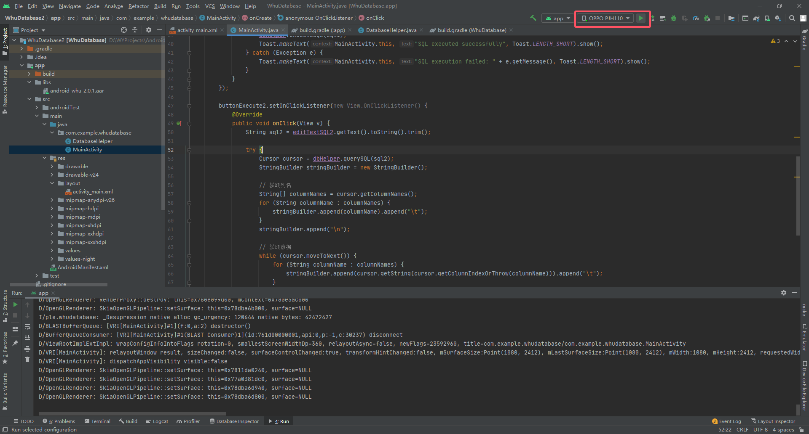